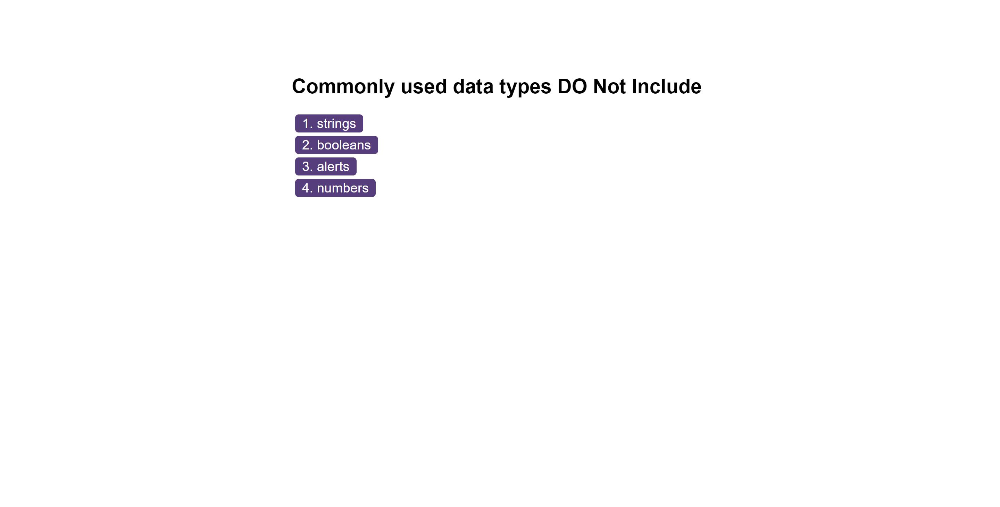

# Multiple-choice-coding-quiz
I have create a timed, multiple-choice coding quiz that can keep track of high scores and quiz-takers' names/initials. You start off with 45 seconds on the timer and you have to answer three questions in that time frame. If you answer a question incorrectly, you will have some time deducted from your remaining timer. The quiz ends if the timer reaches zero or you answer all three questions. A final score is presented and you have the chance to submit your name/initials to the highscores. If you click on the view highscores then you can visually see a a leader board of highscores. Each player has their name/initials and score in the list. Then you can either go back and retake the quiz or clear the highscores list.

## Installation

There's no installation required, this has 2 HTML files, 3 javascript files and a css file.

    
## Usage/Examples

## Deployment

https://yusufdev15.github.io/Multiple-choice-coding-quiz/

## Credits

freecodecamp.org/news/how-to-write-better-git-commit-messages/
- mozzilla developer - https://developer.mozilla.org
- file:///C:/Users/Yusuf/OneDrive/Desktop/class/modules/06-web-apis-Module/03-client-side-storage/07-Stu-Word-Guess/index.html
- https://edabit.com/challenge/ARr5tA458o2tC9FTN
- https://developer.mozilla.org/en-US/docs/Web/API/Element/removeAttribute
- https://developer.mozilla.org/en-US/docs/Web/API/Element/keyup_event
- https://www.w3schools.com/jsref/dom_obj_all.asp
## License

[MIT](https://choosealicense.com/licenses/mit/)

